Conclusions
===========

Comparative Evaluation
----------------------

The following section summarizes the comparative evaluation of the employed models, vectorization methods, and clustering techniques, focusing the accuracy and F1-score.

Gender Classification
~~~~~~~~~~~~~~~~~~~~~~

It can be seen that Word2Vec + NN achieves the highest accuracy for gender classification, followed closely by BERT + NN and TF-IDF + NN. The use of neural networks appears to enhance performance across all vectorization methods compared to traditional classifiers like SVM and Logistic Regression.

On the other hand, Logistic Regression with TF-IDF vectorization shows the best F1-score, closely followed by SVM with TF-IDF and NN with TF-IDF, indicating that TF-IDF is particularly effective for this classification task.

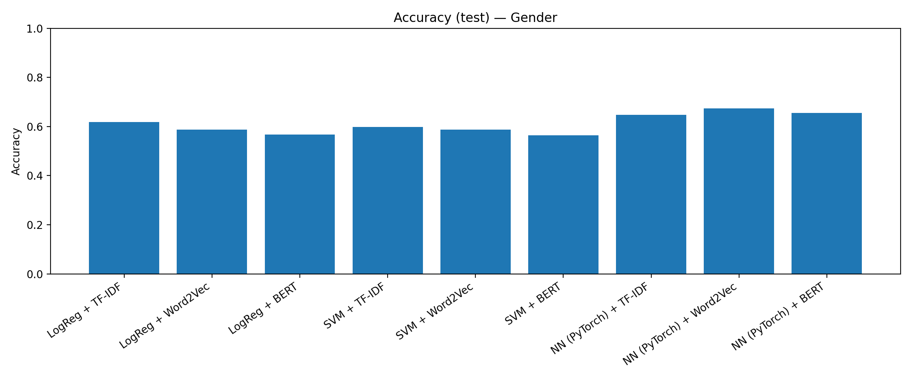

   Brief comparison of accuracy for gender classification across different models and vectorization methods.

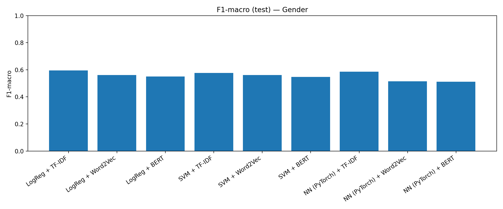

   Brief comparison of F1-score for gender classification across different models and vectorization methods.

Profession Classification
~~~~~~~~~~~~~~~~~~~~~~~~~

In the case of profession classification, the Neural Network wins again. The highest accuracy is achieved by TF-IDF + NN, followed by Word2Vec + NN. Then, SVM with Word2Vec and TF-IDF also achieves a close performance, and very close to BERT + NN. Logistic Regression only manages to achieve a good performance when combined with TF-IDF vectorization.

Regarding the F1-score, all models perform quite similarly, with SVM + TF-IDF achieving the highest score. Even though, the F1 score is lower than in the gender classification task. 

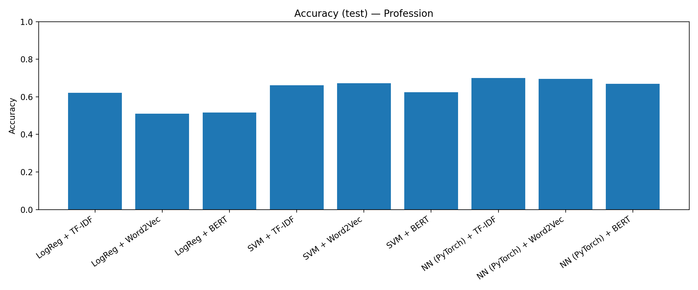

   Brief comparison of accuracy for profession classification across different models and vectorization methods.

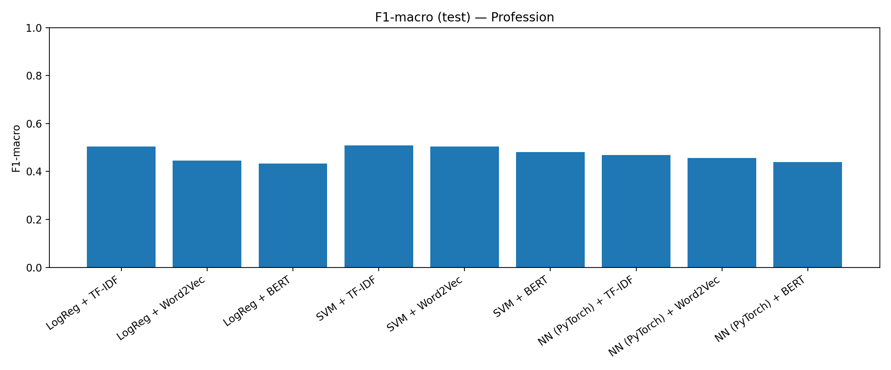

    Brief comparison of F1-score for profession classification across different models and vectorization methods.

Ideology Classification (Binary)
~~~~~~~~~~~~~~~~~~~~~~~~~~~~~~~~

For binary ideology classification, models combined with TF-IDF vectorization consistently outperform those using Word2Vec and BERT. All models perform quite similarly, with Neural Networks achieving the highest accuracy, followed closely by SVM and Logistic Regression. These results are also reflected in the F1-scores, where TF-IDF + NN leads, followed by TF-IDF + SVM and TF-IDF + Logistic Regression.

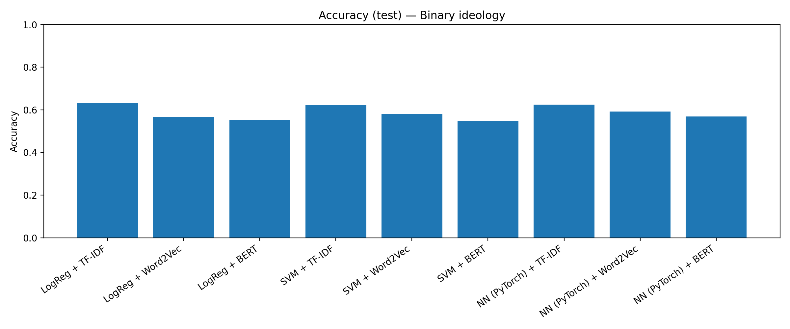

   Brief comparison of accuracy for binary ideology classification across different models and vectorization methods.

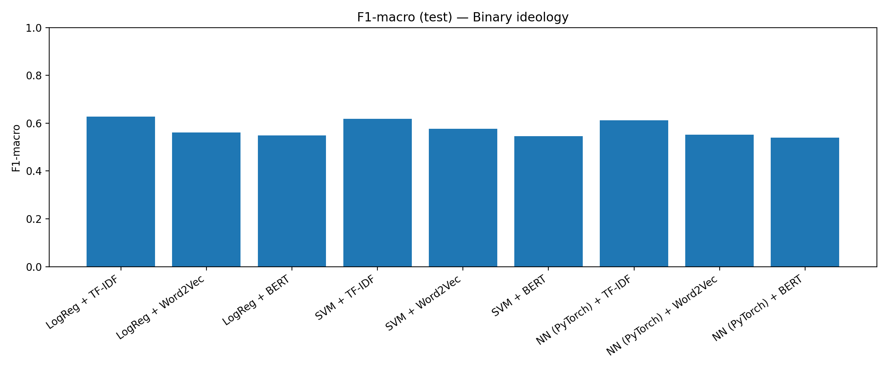

   Brief comparison of F1-score for binary ideology classification across different models and vectorization methods.

Ideology Classification (Multiclass)
~~~~~~~~~~~~~~~~~~~~~~~~~~~~~~~~~~~~

The prediction of multiclass ideology shows a similar trend to the binary case, with TF-IDF vectorization outperforming Word2Vec and BERT across all models. In this case, SVM achieves the highest accuracy and F1-score, but is much lower than in the binary case.

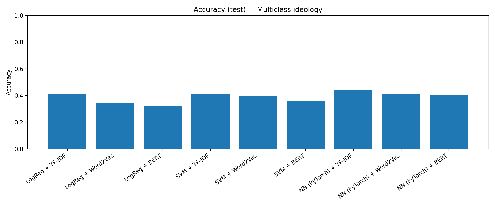

   Brief comparison of accuracy for multiclass ideology classification across different models and vectorization methods.

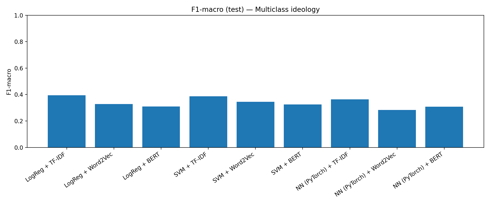
   
   Brief comparison of F1-score for multiclass ideology classification across different models and vectorization methods.

Heatmaps
~~~~~~~~

The following heatmaps provide a visual representation of the accuracy and F1-score achieved by each combination of model and vectorization method across all classification tasks.

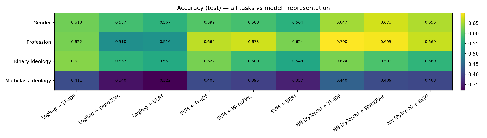

   Heatmap showing accuracy across different models and vectorization methods for all classification tasks.

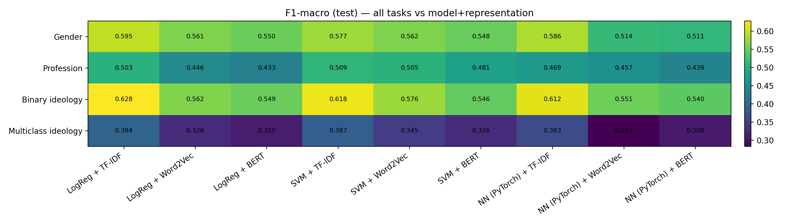

   Heatmap showing F1-score across different models and vectorization methods for all classification tasks.

Mean Scores
~~~~~~~~~~~

To summarize the overall performance, the mean accuracy and F1-score across all classification tasks for each model and vectorization method combination are presented below.

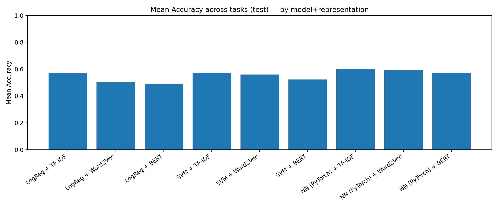

   Mean accuracy across all classification tasks for different models and vectorization methods.

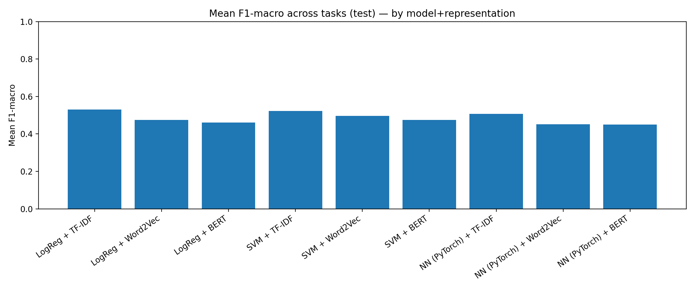

   Mean F1-score across all classification tasks for different models and vectorization methods.

Future Work
-----------

Future enhancements could further strengthen model performance, topic resolution, and overall system robustness. Below are several potential development lines:

- Apply systematic techniques to estimate the optimal number of clusters (e.g., elbow, silhouette, DBI).  
- Explore deeper or alternative neural architectures, particularly for sequence-based models.  
- Increase training epochs and refine hyperparameters for Transformer-based models.  
- Evaluate multilingual or domain-adapted language models to improve generalization.  
- Test alternative clustering algorithms (e.g., HDBSCAN, spectral clustering, GMM).  
- Improve reproducibility through more structured experiment tracking and versioning.  

Limitations
-----------

The project faced several practical and methodological constraints that shaped the final outcomes, some of which were mitigated by reducing dataset size and leveraging cloud or virtual environments such as Kaggle:

- Limited GPU availability restricted model depth, training duration, and hyperparameter search.  
- Memory and RAM constraints affected the processing of large embedding matrices and slowed experimentation.  
- Strong topic imbalance, especially evident in BERTopic outputs.  
- High sensitivity to preprocessing decisions (tokenization, stopword filtering, normalization).  
- Restricted fine-tuning of Transformer models due to computational resource limits.  
- Potential overfitting for rare topics or very small clusters.  
- Limited capacity to run cross-validation or extensive ablation studies.  
- Dependence on third-party environments introduced variability in execution times and resource stability.  

Conclusions
-----------

The results offer a structured view of how different modeling strategies capture thematic patterns in political discourse. In summary:

- BERTopic provides more coherent, fine-grained, and interpretable topics than K-Means.  
- K-Means generates broader, more generic clusters that are useful for coarse segmentation.  
- Both approaches confirm that the dataset is heavily dominated by Spanish political content.  
- BERTopic's outlier detection contributes an interpretability advantage absent in standard clustering.  
- Overall, BERTopic delivers richer topic organization, while K-Means remains a solid and scalable baseline.  
