Modeling Evaluation
===================

Scikit-learn algorithms
------------------------

In this section we describe the classical machine-learning baselines implemented with scikit-learn for the political ideology classification task. We consider two linear classifiers, Logistic Regression and Linear SVM, and combine them with three different input representations: TF-IDF, Word2Vec embeddings and BERT embeddings. All experiments share the same data processing pipeline: we load the original dataset, apply a fixed train/validation/test split, and encode the target labels (both ideology_binary and ideology_multiclass) into numerical form using a LabelEncoder, ensuring a consistent mapping across splits.

For each pair (model, representation) we train the classifier on the training set and evaluate it on both validation and test sets. The evaluation reports accuracy, macro-averaged F1-score, the full classification report and the confusion matrix, which allows us to analyse not only the overall performance but also potential biases between classes. Finally, we aggregate the results into a comparative table covering all combinations of representation, model type and task (binary vs. multiclass). This provides a systematic and reproducible benchmarking framework that will serve as a reference point for the more complex neural and Transformer-based models introduced later in the project.

LogReg + TF-IDF
^^^^^^^^^^^^^^^^

This subsection presents the results obtained with **Logistic Regression** using **TF-IDF representations**. This configuration serves as a linear baseline for text classification and allows us to analyse how sparse lexical features perform
across the different prediction tasks.

Evaluation results
"""""""""""""""""""

+-------------------+----------------------+----------+----------+
| Model             | Task                 | Accuracy | F1-macro |
+===================+======================+==========+==========+
| LogReg + TF-IDF   | Gender               | 0.6178   | 0.5951   |
+-------------------+----------------------+----------+----------+
| LogReg + TF-IDF   | Profession           | 0.6218   | 0.5034   |
+-------------------+----------------------+----------+----------+
| LogReg + TF-IDF   | Binary ideology      | 0.6309   | 0.6276   |
+-------------------+----------------------+----------+----------+
| LogReg + TF-IDF   | Multiclass ideology  | 0.4107   | 0.3942   |
+-------------------+----------------------+----------+----------+

Confusion matrices
""""""""""""""""""

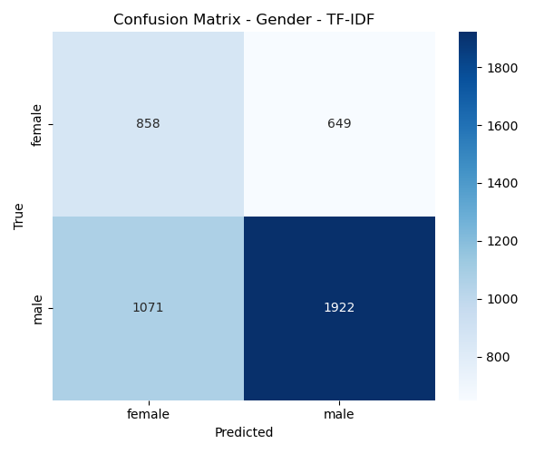

   Confusion matrix for gender classification (Logistic Regression + TF-IDF).

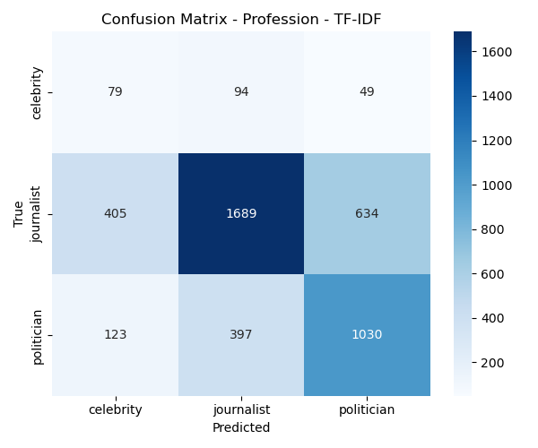

   Confusion matrix for profession classification (Logistic Regression + TF-IDF).

.. figure:: _static/LogReg_TFIDF/confusion_matrix_ideology_bin_TFIDF_logreg.png
   :width: 60%
   :align: center

   Confusion matrix for binary ideology classification (Logistic Regression + TF-IDF).

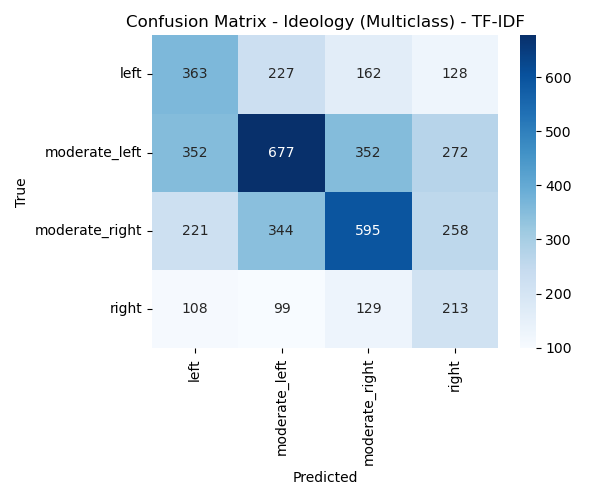

   Confusion matrix for multiclass ideology classification (Logistic Regression + TF-IDF).

LogReg + Word2Vec 
^^^^^^^^^^^^^^^^^^^

This subsection presents the results obtained with **Logistic Regression** using
**Word2Vec embeddings** as input representation. In this setting, tweets are
represented as dense vectors obtained by averaging word-level embeddings, which
allows us to assess whether distributed semantic representations improve the
performance of linear classifiers compared to sparse TF-IDF features.

Evaluation results
""""""""""""""""""

+---------------------+----------------------+----------+----------+
| Model               | Task                 | Accuracy | F1-macro |
+=====================+======================+==========+==========+
| LogReg + Word2Vec   | Gender               | 0.5871   | 0.5613   |
+---------------------+----------------------+----------+----------+
| LogReg + Word2Vec   | Profession           | 0.5100   | 0.4459   |
+---------------------+----------------------+----------+----------+
| LogReg + Word2Vec   | Binary ideology      | 0.5671   | 0.5618   |
+---------------------+----------------------+----------+----------+
| LogReg + Word2Vec   | Multiclass ideology  | 0.3400   | 0.3278   |
+---------------------+----------------------+----------+----------+

Confusion matrices
""""""""""""""""""

.. figure:: _static/LogReg_w2v/confusion_matrix_gender_w2v_logreg.png
   :width: 60%
   :align: center

   Confusion matrix for gender classification (Logistic Regression + Word2Vec).

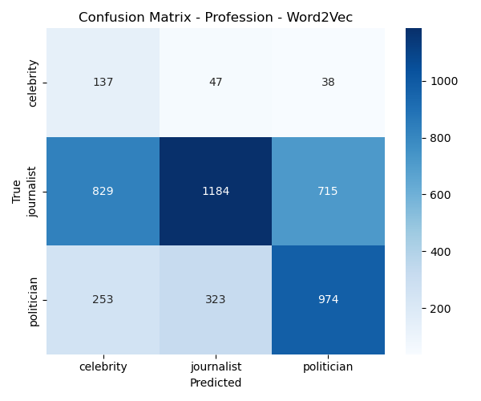

   Confusion matrix for profession classification (Logistic Regression + Word2Vec).

.. figure:: _static/LogReg_w2v/confusion_matrix_ideology_bin_w2v_logreg.png
   :width: 60%
   :align: center

   Confusion matrix for binary ideology classification (Logistic Regression + Word2Vec).

.. figure:: _static/LogReg_w2v/confusion_matrix_ideology_multi_w2v_logreg.png
   :width: 60%
   :align: center

   Confusion matrix for multiclass ideology classification (Logistic Regression + Word2Vec).

LogReg + BERT
^^^^^^^^^^^^^

This subsection presents the results obtained with **Logistic Regression** using
**BERT-based embeddings** as input representation. In this configuration, each
tweet is represented by a dense contextual embedding extracted from a
pretrained multilingual BERT model, allowing the linear classifier to exploit
semantic and contextual information beyond surface-level lexical features.

Evaluation results
""""""""""""""""""

+------------------+----------------------+----------+----------+
| Model            | Task                 | Accuracy | F1-macro |
+==================+======================+==========+==========+
| LogReg + BERT    | Gender               | 0.5667   | 0.5502   |
+------------------+----------------------+----------+----------+
| LogReg + BERT    | Profession           | 0.5164   | 0.4328   |
+------------------+----------------------+----------+----------+
| LogReg + BERT    | Binary ideology      | 0.5522   | 0.5492   |
+------------------+----------------------+----------+----------+
| LogReg + BERT    | Multiclass ideology  | 0.3216   | 0.3102   |
+------------------+----------------------+----------+----------+

Confusion matrices
""""""""""""""""""

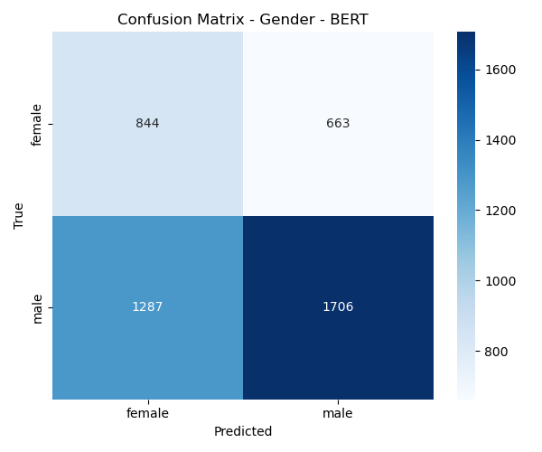

   Confusion matrix for gender classification (Logistic Regression + BERT).

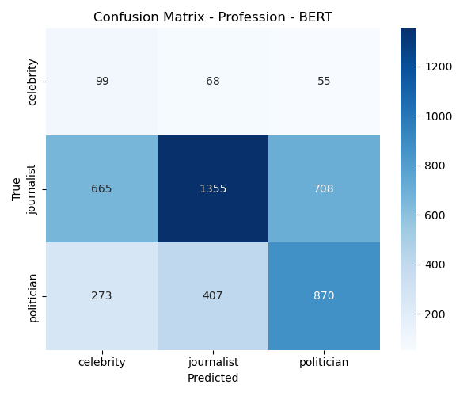

   Confusion matrix for profession classification (Logistic Regression + BERT).

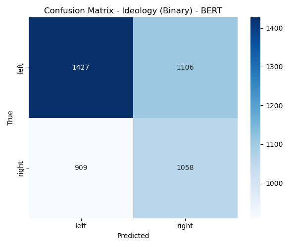

   Confusion matrix for binary ideology classification (Logistic Regression + BERT).

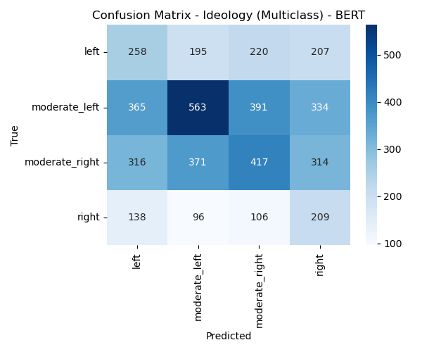

   Confusion matrix for multiclass ideology classification (Logistic Regression + BERT).

SVM + TF-IDF
^^^^^^^^^^^^

This subsection presents the results obtained with a **Linear Support Vector Machine (SVM)**
using **TF-IDF representations**. As in the Logistic Regression baseline, tweets are encoded
as sparse lexical feature vectors, but the SVM classifier optimises a maximum-margin
decision boundary, which often leads to improved generalisation in high-dimensional spaces.

Evaluation results
""""""""""""""""""

+-------------------+----------------------+----------+----------+
| Model             | Task                 | Accuracy | F1-macro |
+===================+======================+==========+==========+
| SVM + TF-IDF      | Gender               | 0.5987   | 0.5768   |
+-------------------+----------------------+----------+----------+
| SVM + TF-IDF      | Profession           | 0.6622   | 0.5088   |
+-------------------+----------------------+----------+----------+
| SVM + TF-IDF      | Binary ideology      | 0.6218   | 0.6184   |
+-------------------+----------------------+----------+----------+
| SVM + TF-IDF      | Multiclass ideology  | 0.4082   | 0.3868   |
+-------------------+----------------------+----------+----------+

Confusion matrices
""""""""""""""""""

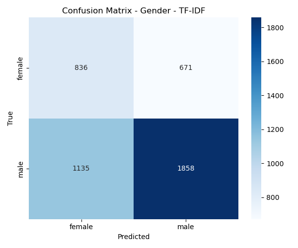

   Confusion matrix for gender classification (Linear SVM + TF-IDF).

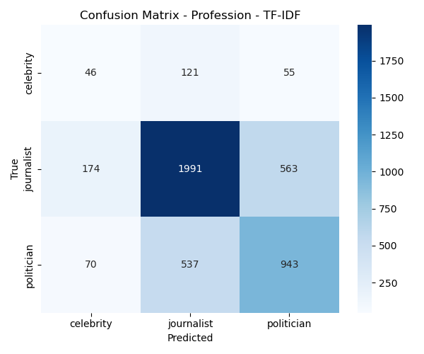

   Confusion matrix for profession classification (Linear SVM + TF-IDF).

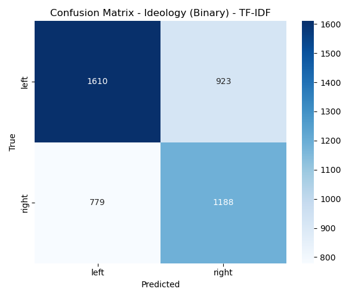

   Confusion matrix for binary ideology classification (Linear SVM + TF-IDF).

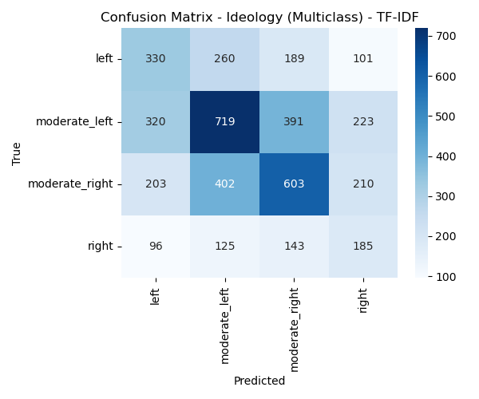

   Confusion matrix for multiclass ideology classification (Linear SVM + TF-IDF).

SVM + Word2Vec
^^^^^^^^^^^^^^

This subsection presents the results obtained with a **Linear Support Vector Machine (SVM)**
using **Word2Vec embeddings** as input representation. Tweets are represented as dense
vectors obtained by averaging word-level embeddings, allowing the SVM classifier to
leverage semantic information while maintaining a linear decision function.

Evaluation results
""""""""""""""""""

+---------------------+----------------------+----------+----------+
| Model               | Task                 | Accuracy | F1-macro |
+=====================+======================+==========+==========+
| SVM + Word2Vec      | Gender               | 0.5880   | 0.5616   |
+---------------------+----------------------+----------+----------+
| SVM + Word2Vec      | Profession           | 0.6731   | 0.5047   |
+---------------------+----------------------+----------+----------+
| SVM + Word2Vec      | Binary ideology      | 0.5800   | 0.5762   |
+---------------------+----------------------+----------+----------+
| SVM + Word2Vec      | Multiclass ideology  | 0.3947   | 0.3454   |
+---------------------+----------------------+----------+----------+

Confusion matrices
""""""""""""""""""

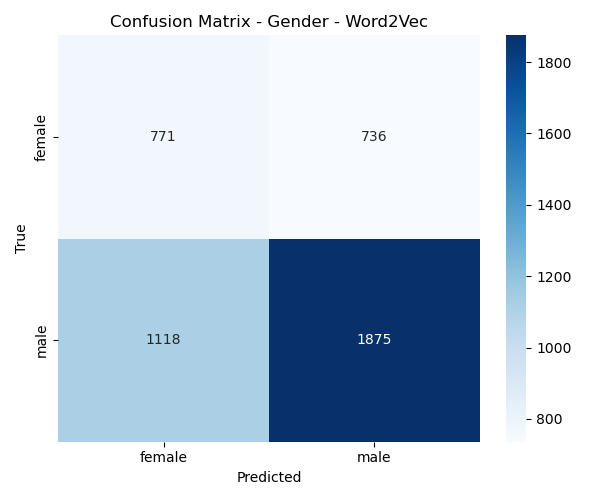

   Confusion matrix for gender classification (Linear SVM + Word2Vec).

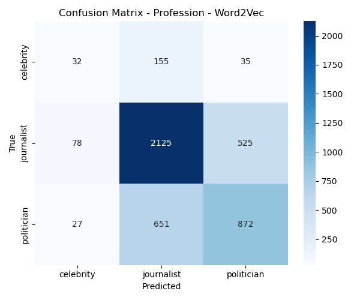

   Confusion matrix for profession classification (Linear SVM + Word2Vec).

.. figure:: _static/SVM_w2v/confusion_matrix_ideology_bin_w2v_svm.png
   :width: 60%
   :align: center

   Confusion matrix for binary ideology classification (Linear SVM + Word2Vec).

.. figure:: _static/SVM_w2v/confusion_matrix_ideology_multi_w2v_svm.png
   :width: 60%
   :align: center

   Confusion matrix for multiclass ideology classification (Linear SVM + Word2Vec).

SVM + BERT
^^^^^^^^^^

This subsection presents the results obtained with a **Linear Support Vector Machine (SVM)**
using **BERT-based embeddings** as input representation. Each tweet is represented by a
dense contextual vector extracted from a pretrained multilingual BERT model, enabling the
linear SVM to exploit semantic and contextual information while maintaining a maximum-margin
decision boundary.

Evaluation results
""""""""""""""""""

+------------------+----------------------+----------+----------+
| Model            | Task                 | Accuracy | F1-macro |
+==================+======================+==========+==========+
| SVM + BERT       | Gender               | 0.5638   | 0.5477   |
+------------------+----------------------+----------+----------+
| SVM + BERT       | Profession           | 0.6242   | 0.4810   |
+------------------+----------------------+----------+----------+
| SVM + BERT       | Binary ideology      | 0.5484   | 0.5456   |
+------------------+----------------------+----------+----------+
| SVM + BERT       | Multiclass ideology  | 0.3569   | 0.3255   |
+------------------+----------------------+----------+----------+

Confusion matrices
""""""""""""""""""

.. figure:: _static/SVM_BERT/confusion_matrix_gender_BERT_svm.png
   :width: 60%
   :align: center

   Confusion matrix for gender classification (Linear SVM + BERT).

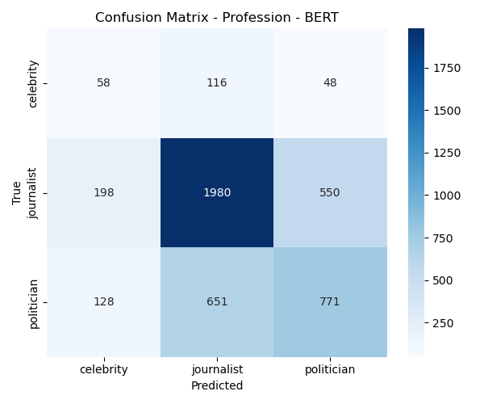

   Confusion matrix for profession classification (Linear SVM + BERT).

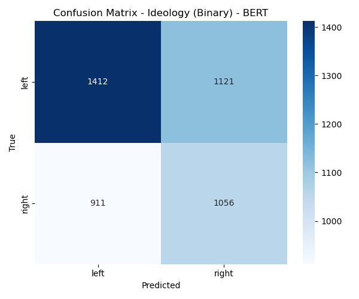

   Confusion matrix for binary ideology classification (Linear SVM + BERT).

.. figure:: _static/SVM_BERT/confusion_matrix_ideology_multi_BERT_svm.png
   :width: 60%
   :align: center

   Confusion matrix for multiclass ideology classification (Linear SVM + BERT).

PyTorch neural network
----------------------

In addition to the scikit-learn baselines, we implement a feedforward neural network using PyTorch. This model operates on fixed-size dense input vectors computed from the tweet text by the ``TextVectorRepresentation`` module (e.g. TF-IDF or BERT-based embeddings), which act as document-level representations.

The architecture is a simple multilayer perceptron: the input embedding is flattened and passed through two fully connected layers of sizes 512 and 256 with ReLU activations, followed by a final linear layer with 4 outputs. These outputs correspond to the four classification tasks defined in the politicES dataset: gender, profession, binary ideology and multiclass ideology. In this way, the network is trained in a multi-task setting, learning a shared representation of the tweet that is useful for all targets simultaneously.

Labels are constructed by mapping the raw string annotations from the dataset (gender, profession and ideology fields) to integer codes using a dedicated mapping function. The model is trained on top of these BERT embeddings on the training split and then evaluated on the validation and test splits, using the same metrics as for the scikit-learn baselines (accuracy and macro-averaged F1-score per task). The final results of the PyTorch neural network will be summarised in a separate table, allowing a direct comparison with the Logistic Regression and Linear SVM baselines described above.

NN (PyTorch) + TF-IDF
^^^^^^^^^^^^^^^^^^^^^

The following table reports the test performance (accuracy and macro F1-score) of the PyTorch neural network using TF-IDF representations for the different prediction tasks.

+-------------------------+----------------------+----------+----------+
| Model                   | Task                 | Accuracy | F1-macro |
+=========================+======================+==========+==========+
| NN (PyTorch) + TF-IDF   | Gender               | 0.6473   | 0.5858   |
+-------------------------+----------------------+----------+----------+
| NN (PyTorch) + TF-IDF   | Profession           | 0.6998   | 0.4687   |
+-------------------------+----------------------+----------+----------+
| NN (PyTorch) + TF-IDF   | Binary ideology      | 0.6242   | 0.6124   |
+-------------------------+----------------------+----------+----------+
| NN (PyTorch) + TF-IDF   | Multiclass ideology  | 0.4404   | 0.3634   |
+-------------------------+----------------------+----------+----------+

Confusion matrices
""""""""""""""""""

.. figure:: _static/NN_TFIDF/Confusion_matrix_gender_tfidf.png
   :width: 60%
   :align: center

   Confusion matrix for gender classification (NN + TF-IDF).

.. figure:: _static/NN_TFIDF/Confusion_matrix_prof_tfidf.png
   :width: 60%
   :align: center

   Confusion matrix for profession classification (NN + TF-IDF).

.. figure:: _static/NN_TFIDF/Confusion_matrix_ideology_bin_tfidf.png
   :width: 60%
   :align: center

   Confusion matrix for binary ideology classification (NN + TF-IDF).

.. figure:: _static/NN_TFIDF/Confusion_matrix_ideology_multi_tfidf.png
   :width: 60%
   :align: center

   Confusion matrix for multiclass ideology classification (NN + TF-IDF).

Training and validation loss
"""""""""""""""""""""""""""""

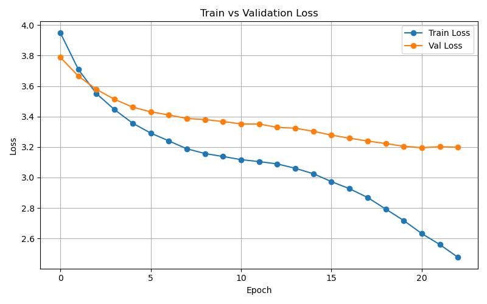

   Training vs validation loss across epochs for the TF-IDF neural network.

NN (PyTorch) + Word2Vec
^^^^^^^^^^^^^^^^^^^^^^^

The following table reports the test performance (accuracy and macro F1-score) of the PyTorch neural network using Word2Vec representations for the different prediction tasks.

+---------------------------+----------------------+----------+----------+
| Model                     | Task                 | Accuracy | F1-macro |
+===========================+======================+==========+==========+
| NN (PyTorch) + Word2Vec   | Gender               | 0.6733   | 0.5145   |
+---------------------------+----------------------+----------+----------+
| NN (PyTorch) + Word2Vec   | Profession           | 0.6953   | 0.4567   |
+---------------------------+----------------------+----------+----------+
| NN (PyTorch) + Word2Vec   | Binary ideology      | 0.5920   | 0.5515   |
+---------------------------+----------------------+----------+----------+
| NN (PyTorch) + Word2Vec   | Multiclass ideology  | 0.4093   | 0.2835   |
+---------------------------+----------------------+----------+----------+

Confusion matrices
""""""""""""""""""

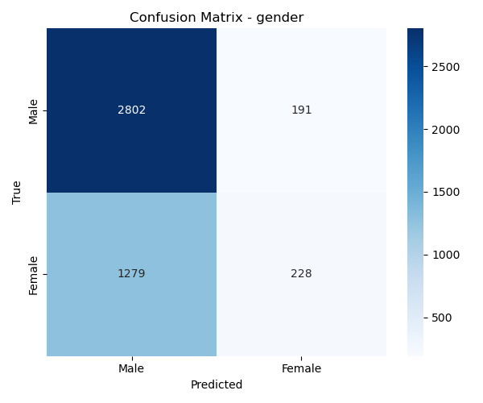

   Confusion matrix for gender classification (NN + Word2Vec).

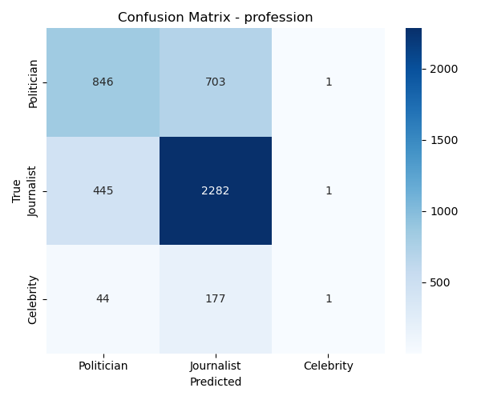

   Confusion matrix for profession classification (NN + Word2Vec).

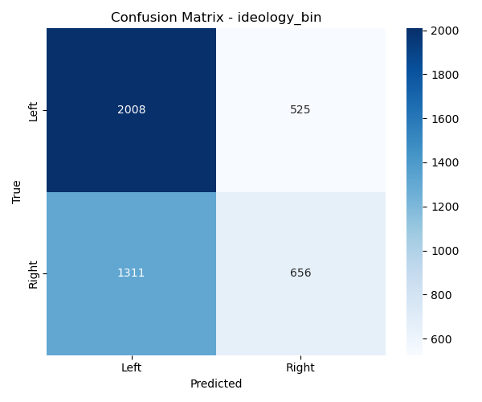

   Confusion matrix for binary ideology classification (NN + Word2Vec).

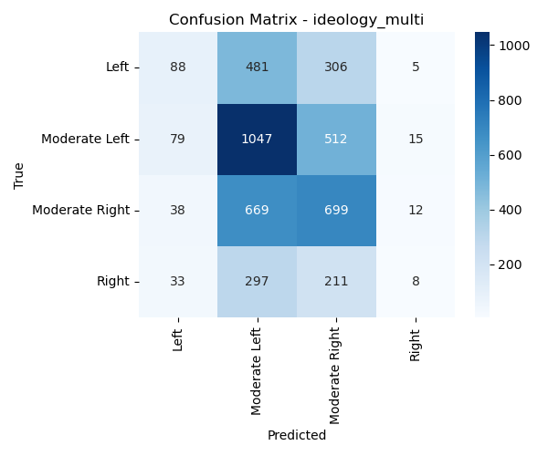

   Confusion matrix for multiclass ideology classification (NN + Word2Vec).

Training and validation loss
"""""""""""""""""""""""""""""

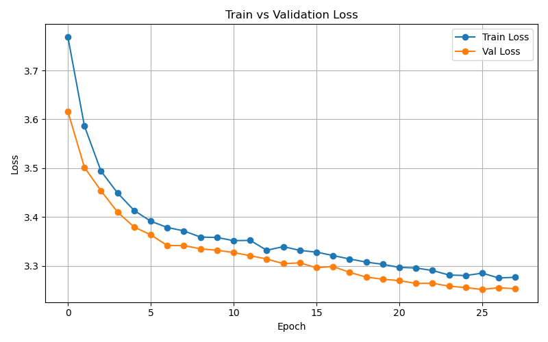

   Training vs validation loss across epochs for the Word2Vec neural network.

NN (PyTorch) + BERT
^^^^^^^^^^^^^^^^^^^^
The following table reports the test performance (accuracy and macro F1-score) of the PyTorch neural network using BERT-based embeddings.

+------------------------+----------------------+----------+----------+
| Model                  | Task                 | Accuracy | F1-macro |
+========================+======================+==========+==========+
| NN (PyTorch) + BERT    | Gender               | 0.6547   | 0.5115   |
+------------------------+----------------------+----------+----------+
| NN (PyTorch) + BERT    | Profession           | 0.6687   | 0.4387   |
+------------------------+----------------------+----------+----------+
| NN (PyTorch) + BERT    | Binary ideology      | 0.5687   | 0.5403   |
+------------------------+----------------------+----------+----------+
| NN (PyTorch) + BERT    | Multiclass ideology  | 0.4031   | 0.3085   |
+------------------------+----------------------+----------+----------+

Confusion matrices
""""""""""""""""""

.. figure:: _static/NN_BERT/confusion_matrix_gender_bert.png
   :width: 60%
   :align: center

   Confusion matrix for gender classification (NN + BERT).

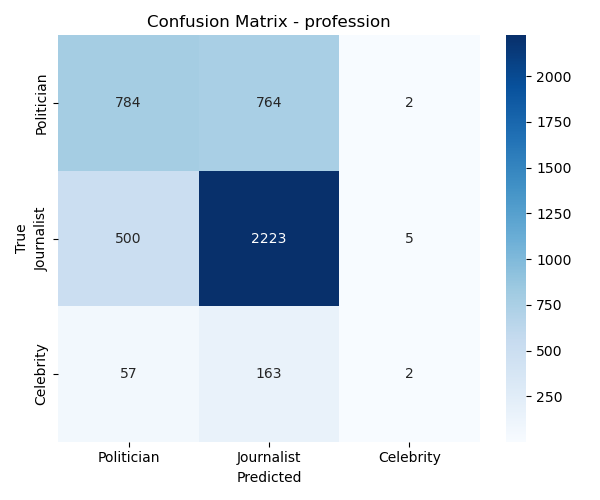

   Confusion matrix for profession classification (NN + BERT).

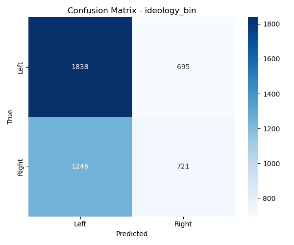

   Confusion matrix for binary ideology classification (NN + BERT).

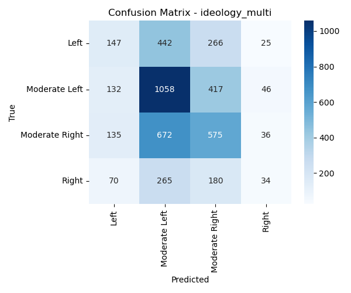

   Confusion matrix for multiclass ideology classification (NN + BERT).

Training and validation loss
"""""""""""""""""""""""""""""

.. figure:: _static/NN_BERT/train_vs_validation_loss.png
   :width: 80%
   :align: center

   Training vs validation loss across epochs for the BERT-based neural network.