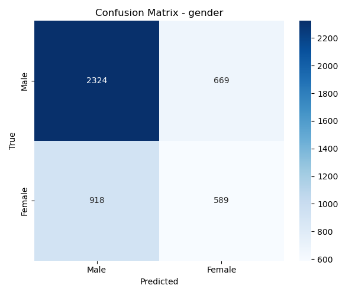
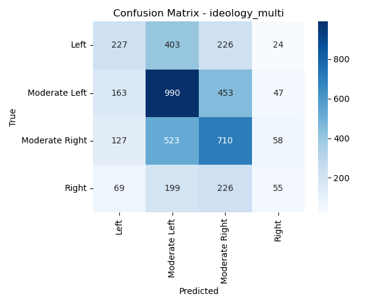

Modeling Evaluation
===================

Scikit-learn algorithms
------------------------

In this section we describe the classical machine-learning baselines implemented with scikit-learn for the political ideology classification task. We consider two linear classifiers, Logistic Regression and Linear SVM, and combine them with three different input representations: TF-IDF, Word2Vec embeddings and BERT embeddings. All experiments share the same data processing pipeline: we load the original dataset, apply a fixed train/validation/test split, and encode the target labels (both ideology_binary and ideology_multiclass) into numerical form using a LabelEncoder, ensuring a consistent mapping across splits.

For each pair (model, representation) we train the classifier on the training set and evaluate it on both validation and test sets. The evaluation reports accuracy, macro-averaged F1-score, the full classification report and the confusion matrix, which allows us to analyse not only the overall performance but also potential biases between classes. Finally, we aggregate the results into a comparative table covering all combinations of representation, model type and task (binary vs. multiclass). This provides a systematic and reproducible benchmarking framework that will serve as a reference point for the more complex neural and Transformer-based models introduced later in the project.

Evaluation results for Logistic Regression and SVM
^^^^^^^^^^^^^^^^^^^^^^^^^^^^^^^^^^^^^^^^^^^^^^^^^^

The following table summarizes the test performance (accuracy and macro F1-score) of all model–representation combinations for both the binary and multiclass ideology classification tasks.

+-------------------+-----------+----------+----------+
| Model             | Task      | Accuracy | F1-macro |
+===================+===========+==========+==========+
| LogReg + TF-IDF   | Binary    | 0.6267   | 0.6011   |
+-------------------+-----------+----------+----------+
| LogReg + Word2Vec | Binary    | 0.4667   | 0.4658   |
+-------------------+-----------+----------+----------+
| LogReg + BERT     | Binary    | 0.5467   | 0.5463   |
+-------------------+-----------+----------+----------+
| LogReg + TF-IDF   | Multiclass| 0.3533   | 0.3050   |
+-------------------+-----------+----------+----------+
| LogReg + Word2Vec | Multiclass| 0.3133   | 0.2649   |
+-------------------+-----------+----------+----------+
| LogReg + BERT     | Multiclass| 0.3933   | 0.3727   |
+-------------------+-----------+----------+----------+
| SVM + TF-IDF      | Binary    | 0.5800   | 0.5613   |
+-------------------+-----------+----------+----------+
| SVM + Word2Vec    | Binary    | 0.5000   | 0.4998   |
+-------------------+-----------+----------+----------+
| SVM + BERT        | Binary    | 0.5400   | 0.5395   |
+-------------------+-----------+----------+----------+
| SVM + TF-IDF      | Multiclass| 0.3800   | 0.3193   |
+-------------------+-----------+----------+----------+
| SVM + Word2Vec    | Multiclass| 0.3733   | 0.1366   |
+-------------------+-----------+----------+----------+
| SVM + BERT        | Multiclass| 0.3600   | 0.3309   |
+-------------------+-----------+----------+----------+

PyTorch neural network
----------------------

In addition to the scikit-learn baselines, we implement a feedforward neural network using PyTorch. This model operates on fixed-size dense input vectors computed from the tweet text by the ``TextVectorRepresentation`` module (e.g. TF-IDF or BERT-based embeddings), which act as document-level representations.

The architecture is a simple multilayer perceptron: the input embedding is flattened and passed through two fully connected layers of sizes 512 and 256 with ReLU activations, followed by a final linear layer with 4 outputs. These outputs correspond to the four classification tasks defined in the politicES dataset: gender, profession, binary ideology and multiclass ideology. In this way, the network is trained in a multi-task setting, learning a shared representation of the tweet that is useful for all targets simultaneously.

Labels are constructed by mapping the raw string annotations from the dataset (gender, profession and ideology fields) to integer codes using a dedicated mapping function. The model is trained on top of these BERT embeddings on the training split and then evaluated on the validation and test splits, using the same metrics as for the scikit-learn baselines (accuracy and macro-averaged F1-score per task). The final results of the PyTorch neural network will be summarised in a separate table, allowing a direct comparison with the Logistic Regression and Linear SVM baselines described above.

NN (PyTorch) + TF-IDF
^^^^^^^^^^^^^^^^^^^^^

The following table reports the test performance (accuracy and macro F1-score) of the PyTorch neural network using TF-IDF representations for the different prediction tasks.

+-------------------------+----------------------+----------+----------+
| Model                   | Task                 | Accuracy | F1-macro |
+=========================+======================+==========+==========+
| NN (PyTorch) + TF-IDF   | Gender               | 0.6473   | 0.5858   |
+-------------------------+----------------------+----------+----------+
| NN (PyTorch) + TF-IDF   | Profession           | 0.6998   | 0.4687   |
+-------------------------+----------------------+----------+----------+
| NN (PyTorch) + TF-IDF   | Binary ideology      | 0.6242   | 0.6124   |
+-------------------------+----------------------+----------+----------+
| NN (PyTorch) + TF-IDF   | Multiclass ideology  | 0.4404   | 0.3634   |
+-------------------------+----------------------+----------+----------+

Confusion matrices
"""""""""""""""""""

   Confusion matrix for gender (TF-IDF + neural network).

.. figure:: _static/Confusion_matrix_prof_tfidf.png
   :width: 60%
   :align: center

   Confusion matrix for profession (TF-IDF + neural network).

.. figure:: _static/Confusion_matrix_ideology_bin_tfidf.png
   :width: 60%
   :align: center

   Confusion matrix for binary ideology (TF-IDF + neural network).

   Confusion matrix for multiclass ideology (TF-IDF + neural network).

Training and validation loss
"""""""""""""""""""""""""""""

.. figure:: _static/Train_vs_validation_nn_tfidf.png
   :width: 80%
   :align: center

   Training vs validation loss across epochs for the TF-IDF neural network.

NN (PyTorch) + Word2Vec
^^^^^^^^^^^^^^^^^^^^^^^

The following table reports the test performance (accuracy and macro F1-score) of the PyTorch neural network using Word2Vec representations for the different prediction tasks.

+---------------------------+----------------------+----------+----------+
| Model                     | Task                 | Accuracy | F1-macro |
+===========================+======================+==========+==========+
| NN (PyTorch) + Word2Vec   | Gender               | 0.6216   | 0.5574   |
+---------------------------+----------------------+----------+----------+
| NN (PyTorch) + Word2Vec   | Profession           | 0.6405   | 0.4129   |
+---------------------------+----------------------+----------+----------+
| NN (PyTorch) + Word2Vec   | Binary ideology      | 0.5987   | 0.5862   |
+---------------------------+----------------------+----------+----------+
| NN (PyTorch) + Word2Vec   | Multiclass ideology  | 0.4012   | 0.3328   |
+---------------------------+----------------------+----------+----------+

Confusion matrices
""""""""""""""""""

.. figure:: _static/confussion_matrix_gender_w2v.png
   :width: 60%
   :align: center

   Confusion matrix for gender (Word2Vec + neural network).

.. figure:: _static/confussion_matrix_profession_w2v.png
   :width: 60%
   :align: center

   Confusion matrix for profession (Word2Vec + neural network).

.. figure:: _static/confussion_matrix_ideology_bin_w2v.png
   :width: 60%
   :align: center

   Confusion matrix for binary ideology (Word2Vec + neural network).

.. figure:: _static/confussion_matrix_ideology_multi_w2v.png
   :width: 60%
   :align: center

   Confusion matrix for multiclass ideology (Word2Vec + neural network).

Training and validation loss
"""""""""""""""""""""""""""""

.. figure:: _static/train_vs_val_loss.png
   :width: 80%
   :align: center

   Training vs validation loss across epochs for the Word2Vec neural network.

NN (PyTorch) + BERT
^^^^^^^^^^^^^^^^^^^^
The following table reports the test performance (accuracy and macro F1-score) of the PyTorch neural network using BERT-based embeddings.

+------------------------+----------------------+----------+----------+
| Model                  | Task                 | Accuracy | F1-macro |
+========================+======================+==========+==========+
| NN (PyTorch) + BERT    | Gender               | 0.6486   | 0.5894   |
+------------------------+----------------------+----------+----------+
| NN (PyTorch) + BERT    | Profession           | 0.7051   | 0.4743   |
+------------------------+----------------------+----------+----------+
| NN (PyTorch) + BERT    | Binary ideology      | 0.6348   | 0.6216   |
+------------------------+----------------------+----------+----------+
| NN (PyTorch) + BERT    | Multiclass ideology  | 0.4587   | 0.3821   |
+------------------------+----------------------+----------+----------+

Confusion matrices
"""""""""""""""""""""""""""""

.. figure:: _static/confusion_matrix_gender_bert.png
   :width: 60%
   :align: center

   Confusion matrix for gender (BERT + neural network).

.. figure:: _static/confusion_matrix_prof_bert.png
   :width: 60%
   :align: center

   Confusion matrix for profession (BERT + neural network).

.. figure:: _static/confusion_matrix_ideology_bin_bert.png
   :width: 60%
   :align: center

   Confusion matrix for binary ideology (BERT + neural network).

.. figure:: _static/confusion_matrix_ideology_multi_bert.png
   :width: 60%
   :align: center

   Confusion matrix for multiclass ideology (BERT + neural network).

Training and validation loss
"""""""""""""""""""""""""""""

.. figure:: _static/train_vs_validation_loss.png
   :width: 80%
   :align: center

   Training vs validation loss across epochs for the BERT neural network.