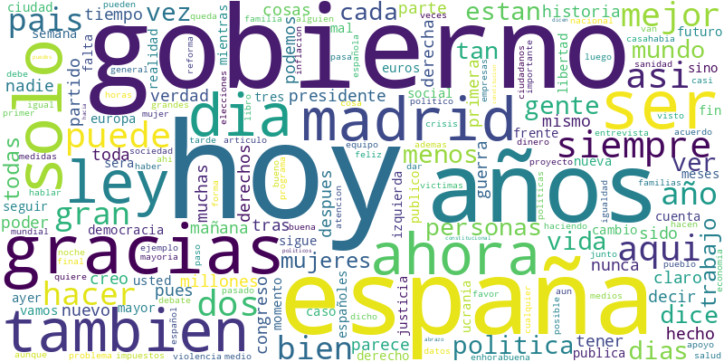

Exploratory Analysis of the Dataset
===================================

This section explores the dataset used in this project, which is the `POLITiCES 2023 dataset <https://codalab.lisn.upsaclay.fr/competitions/10173#learn_the_details-get_starting_kit>`_, focusing on understanding the distribution of ideological polarization among users and the prevalence of disinformation content.

Distribution of Ideological Polarization
----------------------------------------
The training dataset contains 180.000 rows, containing the following columns:

+-----------------------+----------------------------------+
| Column                | Description                      |
+=======================+==================================+
| label                 | user identifier/label            |
+-----------------------+----------------------------------+
| gender                | gender classification            |
+-----------------------+----------------------------------+
| profession            | professional category            |
+-----------------------+----------------------------------+
| ideology_binary       | binary ideology classification   |
+-----------------------+----------------------------------+
| ideology_multiclass   | multi-class ideology             |
|                       | classification                   |
+-----------------------+----------------------------------+
| tweet                 | tweet text content               |
+-----------------------+----------------------------------+

The class distribution is shown in the histogram below, where it can be seen that `gender` and `profession` are less balanced compared to `ideology_binary` and `ideology_multiclass`.

.. image:: _static/class_distribution.png
   :alt: Histogram of Ideological Polarization Scores
   :width: 600px
   :align: center

A preliminary text analysis is performed, including a word cloud visualization of the most frequent words in the tweets, which can be seen below.

Hypothesis
----------

Based on the exploratory analysis, we hypothesize that there is a significant correlation between the ideological polarization of users and the prevalence of disinformation content in their tweets. Specifically, we expect that users with extreme ideological positions (both left and right) are more likely to share disinformation compared to those with moderate views.

In relation to machine learning models, we hypothesize that models incorporating contextual embeddings will outperform traditional bag-of-words or TF-IDF representations in classifying tweets based on ideological polarization and disinformation content.

Logistic Regression and SVM models should perform in a comparable manner, with potential slight advantages for SVM in handling high-dimensional data. However, the performance gap between these traditional models and deep learning approaches (e.g., LSTM, BERT) is expected to be more pronounced, with deep learning models likely achieving higher accuracy due to their ability to capture complex semantic relationships in the text data.

It is expected to obtain better results when classifying `ideology_binary` compared to `ideology_multiclass`, given the increased complexity of distinguishing between multiple classes. Furthermore, it is expected to achieve higher accuracy at political ideology classification compared to gender or profession classification, as ideological polarization is more directly reflected in tweet content.

BERTopic should outperform KMeans clustering in topic discovery tasks, given its ability to automatically determine the optimal number of topics and capture more nuanced thematic structures in the data.